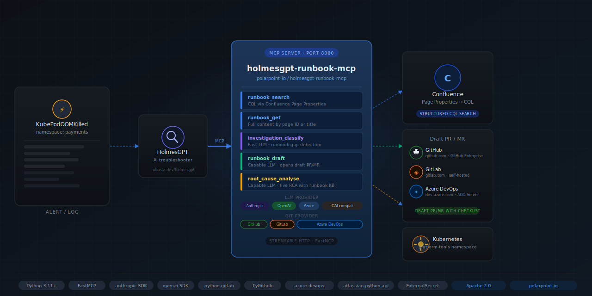

# holmesgpt-runbook-mcp



[](https://github.com/polarpoint-io/holmesgpt-runbook-mcp/actions/workflows/ci.yml)
[](LICENSE)

MCP server for [HolmesGPT](https://github.com/robusta-dev/holmesgpt) — runbook search, gap detection, AI-assisted drafting, and root cause analysis.

Works with any LLM provider (Anthropic, OpenAI, Azure OpenAI, or any OpenAI-compatible endpoint) and any Git provider (GitHub, GitLab, or Azure DevOps).

## What it does

Five tools that give HolmesGPT (and any Confluence MCP client) a structured runbook layer:

| Tool | What it does |
|------|-------------|
| `runbook_search` | CQL search by `service`, `failure_mode`, `alert_name` via Confluence Page Properties — exact match, not fuzzy |
| `runbook_get` | Full runbook content by page ID or title |
| `investigation_classify` | Fast LLM (LLM_FAST_MODEL) classifies an investigation log as a runbook gap |
| `runbook_draft` | Capable LLM (LLM_CAPABLE_MODEL) drafts a runbook from investigation logs → opens draft PR/MR |
| `root_cause_analyse` | Pulls matching runbooks + capable LLM reasons over live incident data |

## Why CQL beats full-text search

Runbooks published via [python-mkdocs-to-confluence](https://github.com/polarpoint-io/python-mkdocs-to-confluence) include a `confluence_properties:` frontmatter block that renders as a Confluence Page Properties macro. This server queries those properties directly:

```
property["Service"]="payments-api" AND property["Failure-Mode"]="OOMKill"
```

Holmes finds the exact runbook on the first query instead of ranking 40 pages that mention both terms.

## Runbook format

Runbooks must use the [Polarpoint AI-optimised runbook format](docs/runbook-template.md) with `confluence_properties` frontmatter. The template is included in this repo at [`docs/runbook-template.md`](docs/runbook-template.md). `runbook_draft` generates this format automatically.

## Prerequisites

- HolmesGPT running in your cluster
- Confluence space for runbooks (published via the MkDocs plugin)
- A Git repo containing runbook markdown sources (GitHub, GitLab, or Azure DevOps)
- An API key for your LLM provider of choice

## Quickstart

### 1. Install with your providers

```bash
# Anthropic + GitHub (default)
pip install "holmesgpt-runbook-mcp[anthropic-github]"

# OpenAI + GitLab
pip install "holmesgpt-runbook-mcp[openai-gitlab]"

# Anthropic + Azure DevOps
pip install "holmesgpt-runbook-mcp[anthropic-azure-devops]"

# Everything
pip install "holmesgpt-runbook-mcp[all]"
```

### 2. Deploy to Kubernetes

```bash
# Create secrets (or use ExternalSecrets — see deploy/externalsecret.yaml)
kubectl create secret generic holmesgpt-runbook-mcp-secrets \
  --namespace platform-tools \
  --from-literal=llm-api-key=$LLM_API_KEY \
  --from-literal=confluence-url=$CONFLUENCE_URL \
  --from-literal=confluence-username=$CONFLUENCE_USERNAME \
  --from-literal=confluence-api-token=$CONFLUENCE_API_TOKEN \
  --from-literal=git-token=$GIT_TOKEN

kubectl apply -f deploy/
```

### 3. Wire into HolmesGPT

```yaml
# holmes-config.yaml
mcpServers:
  - name: holmesgpt-runbook-mcp
    url: http://holmesgpt-runbook-mcp.platform-tools.svc.cluster.local:8080/mcp
```

### 4. Test the connection

```bash
curl http://holmesgpt-runbook-mcp.platform-tools.svc.cluster.local:8080/health
```

## LLM provider configuration

Set `LLM_PROVIDER` and the relevant variables. Everything else is optional.

### Anthropic (default)

```bash
LLM_PROVIDER=anthropic
LLM_API_KEY=sk-ant-...
# Optional overrides:
LLM_FAST_MODEL=claude-haiku-4-5-20251001
LLM_CAPABLE_MODEL=claude-sonnet-4-6
```

### OpenAI

```bash
LLM_PROVIDER=openai
LLM_API_KEY=sk-...
LLM_FAST_MODEL=gpt-4o-mini        # default
LLM_CAPABLE_MODEL=gpt-4o          # default
```

### Azure OpenAI

```bash
LLM_PROVIDER=azure
LLM_API_KEY=<azure-api-key>
LLM_BASE_URL=https://<resource>.openai.azure.com/
LLM_AZURE_API_VERSION=2024-02-01  # default
LLM_FAST_MODEL=gpt-4o-mini        # deployment name
LLM_CAPABLE_MODEL=gpt-4o          # deployment name
```

### OpenAI-compatible (Ollama, vLLM, Together, Groq, etc.)

```bash
LLM_PROVIDER=openai-compatible
LLM_BASE_URL=http://ollama.platform-tools.svc.cluster.local:11434/v1
LLM_API_KEY=none                  # use 'none' if endpoint doesn't require a key
LLM_FAST_MODEL=llama3
LLM_CAPABLE_MODEL=llama3:70b
```

## Git provider configuration

Set `GIT_PROVIDER` and the relevant variables.

### GitHub (default)

```bash
GIT_PROVIDER=github
GIT_TOKEN=ghp_...                 # PAT with repo write scope
GIT_RUNBOOK_REPO=org/repo
GIT_BASE_BRANCH=main              # default
# Self-hosted GitHub Enterprise:
# GIT_HOST=github.myco.com
```

### GitLab

```bash
GIT_PROVIDER=gitlab
GIT_TOKEN=glpat-...               # Personal access token with api scope
GIT_RUNBOOK_REPO=group/repo       # or group/subgroup/repo
GIT_BASE_BRANCH=main
# Self-hosted:
GIT_HOST=https://gitlab.myco.com  # default: https://gitlab.com
```

### Azure DevOps

```bash
GIT_PROVIDER=azure-devops
GIT_TOKEN=<pat>                   # PAT with Code (Read & Write) scope
GIT_HOST=https://dev.azure.com/my-org
GIT_RUNBOOK_REPO=ProjectName/RepoName
GIT_BASE_BRANCH=main
```

## Full environment variable reference

| Variable | Required | Default | Description |
|----------|----------|---------|-------------|
| `LLM_PROVIDER` | | `anthropic` | `anthropic` \| `openai` \| `azure` \| `openai-compatible` |
| `LLM_API_KEY` | ✅ | — | API key for your LLM provider |
| `LLM_FAST_MODEL` | | provider default | Model for classification (cheap/fast) |
| `LLM_CAPABLE_MODEL` | | provider default | Model for drafting and RCA (more capable) |
| `LLM_BASE_URL` | ✅ azure/compatible | — | Endpoint URL for Azure or self-hosted |
| `LLM_AZURE_API_VERSION` | | `2024-02-01` | Azure OpenAI API version |
| `GIT_PROVIDER` | | `github` | `github` \| `gitlab` \| `azure-devops` |
| `GIT_TOKEN` | ✅ | — | Git provider personal access token |
| `GIT_RUNBOOK_REPO` | | `polarpoint-io/markdown-pol-docs` | `org/repo` (GitHub/GitLab) or `Project/Repo` (Azure DevOps) |
| `GIT_BASE_BRANCH` | | `main` | Branch to open PRs/MRs against |
| `GIT_HOST` | ✅ azure-devops | — | Self-hosted URL or Azure DevOps org URL |
| `CONFLUENCE_URL` | ✅ | — | e.g. `https://your-org.atlassian.net/wiki` |
| `CONFLUENCE_USERNAME` | ✅ | — | Atlassian email |
| `CONFLUENCE_API_TOKEN` | ✅ | — | Atlassian API token |
| `CONFLUENCE_RUNBOOK_SPACE` | | `RUNBOOKS` | Confluence space key |
| `RUNBOOK_PATH_PREFIX` | | `docs/technical-practices/...` | Path prefix for runbook files in repo |

## Development

```bash
# Install dev dependencies (includes all providers)
pip install -e ".[dev]"

# Run tests
pytest tests/

# Lint
ruff check src/ tests/
black --check src/ tests/

# Run locally (stdio transport for MCP Inspector)
python -m holmesgpt_runbook_mcp.server
```

## How runbook_draft works

1. Holmes calls `investigation_classify` during an active investigation — the fast LLM classifies the log and returns `has_gap=true` with service/failure_mode/resolution extracted
2. Holmes accumulates classified gaps (in memory or a simple store)
3. When gap count for a (service, failure_mode) pair hits threshold, Holmes calls `runbook_draft` with the accumulated logs
4. The capable LLM drafts the runbook in the AI-optimised format, extracting real commands from the investigation logs
5. `runbook_draft` opens a draft PR/MR with `Status: Draft` — a platform engineer reviews and merges
6. The MkDocs CI build publishes the merged runbook to Confluence
7. Next time the same alert fires, `runbook_search` finds it on the first CQL query

## Related

- [HolmesGPT](https://github.com/robusta-dev/holmesgpt) — the AI troubleshooting assistant this server extends
- [python-mkdocs-to-confluence](https://github.com/polarpoint-io/python-mkdocs-to-confluence) — MkDocs plugin that publishes the Page Properties this server queries
- [Blog: HolmesGPT Knows What Your Runbooks Are Missing](https://polarpoint.io/blog/holmesgpt-runbook-improvement-loop/) — the post this repo was built from

## License

Apache 2.0
